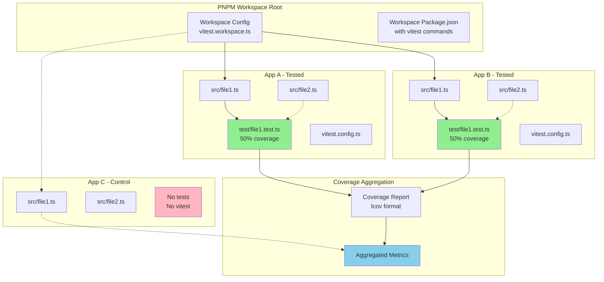

# Test Coverage Aggregation Problem in PNPM Workspace Monorepo

## Problem Statement

The core issue is establishing a **single coverage portable file** after testing step in a monorepo using projects agnostic to ecosystem. The challenge involves getting a single coverage percentage from workspace containing multiple projects with heterogeneous test coverage scenarios.

## Context

This workspace is a PNPM monorepo with the following architectural constraints:
- Multiple applications with varying test coverage configurations
- Need for unified coverage reporting at workspace root level
- Requirement for ecosystem-agnostic test orchestration
- Support for projects with and without testing infrastructure

## Technical Requirements

### Primary Components

#### 1. Test-Enabled Applications (Apps A & B)
- **Location**: `apps/app-a/` and `apps/app-b/`
- **Language**: TypeScript
- **Test Framework**: Vitest
- **Coverage Target**: 50% per application
- **Implementation Requirements**:
  - Two simple TypeScript source files per app
  - One test file per app covering only one source file
  - Vitest configuration with coverage instrumentation

#### 2. Control Application (App C)
- **Location**: `apps/app-c/`
- **Purpose**: Control group to test behavior with non-tested code
- **Configuration**: No tests, no Vitest dependency
- **Expected Behavior**: Should not break workspace-level coverage aggregation

#### 3. Workspace-Level Test Orchestration
- **Configuration**: Vitest projects (workspaces) setup
- **Execution**: Single command from workspace root
- **Coverage Aggregation**: Unified coverage report generation

### Sub-Problems

#### A. Vendor Lock-in and Language Agnosticism
**Problem**: Vitest is abstracting language-specific testing concerns but introduces vendor lock-in to the JavaScript/TypeScript ecosystem.

**Technical Implications**:
- Coverage format standardization across different language ecosystems
- Test runner abstraction for polyglot monorepos
- Portable coverage data exchange formats

#### B. Partial Test Coverage Aggregation
**Problem**: Achieving meaningful coverage metrics when only subset of workspace has tests.

**Technical Challenges**:
- Handling projects without test infrastructure
- Calculating workspace-wide coverage percentages
- Avoiding false positives from untested codebases

#### C. Ecosystem Integration Points
**Problem**: Integration with external knowledge systems and reporting tools.

**Components**:
- **Test Tools**: Framework-agnostic test execution
- **Matcher**: Pattern matching for test discovery
- **Reporter**: Coverage data formatting and export
- **Mocking/Spy System**: Test isolation and instrumentation
- **Environment Provider**: Runtime environment abstraction
- **Coverage Instrumentation**: Code coverage measurement

## Architecture Overview



## Expected Outcomes

### 1. Workspace Structure
```
workspace/
├── pnpm-workspace.yaml
├── package.json (workspace root with vitest scripts)
├── vitest.workspace.ts
├── apps/
│   ├── app-a/
│   │   ├── package.json
│   │   ├── vitest.config.ts
│   │   ├── src/
│   │   │   ├── file1.ts (tested)
│   │   │   └── file2.ts (untested)
│   │   └── test/
│   │       └── file1.test.ts
│   ├── app-b/
│   │   ├── package.json
│   │   ├── vitest.config.ts
│   │   ├── src/
│   │   │   ├── file1.ts (tested)
│   │   │   └── file2.ts (untested)
│   │   └── test/
│   │       └── file1.test.ts
│   └── app-c/
│       ├── package.json (no vitest)
│       └── src/
│           ├── file1.ts
│           └── file2.ts
└── coverage/
    └── lcov.info (aggregated coverage report)
```

### 2. Coverage Metrics
- **App A**: 50% coverage (1 of 2 files tested)
- **App B**: 50% coverage (1 of 2 files tested)
- **App C**: 0% coverage (no tests)
- **Workspace Total**: Calculated aggregate considering all applications

### 3. Command Interface
```bash
# Run tests across all workspace projects
pnpm test

# Generate coverage report
pnpm test:coverage

# Coverage report location
./coverage/lcov.info
```

## Technical Constraints

1. **Ecosystem Agnosticism**: Solution should not be tightly coupled to JavaScript/TypeScript ecosystem
2. **Partial Coverage Handling**: Must gracefully handle projects without test infrastructure
3. **Portable Output**: Coverage data should be in standardized format (LCOV)
4. **Workspace Isolation**: Individual project configurations should remain independent
5. **Scalability**: Solution should work with additional projects added to workspace

## Success Criteria

1. ✅ Workspace-level test command executes successfully
2. ✅ Coverage aggregation produces valid LCOV report
3. ✅ Each tested app achieves exactly 50% coverage
4. ✅ Untested app (App C) doesn't break the build process
5. ✅ Final artifact is a portable coverage report usable by external tools

This problem explores the intersection of monorepo management, test orchestration, and coverage aggregation in a polyglot development environment while maintaining ecosystem flexibility and avoiding vendor lock-in.
